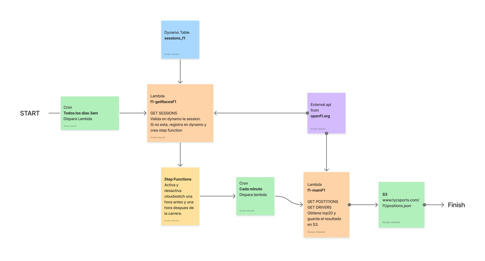

# F1

Proyecto para la visualizacion de las posiciones en tiempo real de cada carrera de F1.

Usamos la api [OpenF1](https://openf1.org/#api-methods)

## Lambdas

- [`getRacesF1.ts`](./lib/lambdas/getRacesF1.ts) Se dispara todos los días, el dia de la carrera, crea una step function.
- [`controlLambda.ts`](./lib/lambdas/controlLambda.ts) Activa y desactiva cloudwatch(cada minuto) usado durante la carrera.
- [`getDataOpenF1.ts`](./lib/lambdas/getDataOpenF1.ts) Obtiene posiciones, hace merge con drivers y devuelve el top20 min a min.

## 📌 A tener en cuenta

Guarda el resultado en un json que sube a s3, luego actualiza min a min.

## Diagrama

